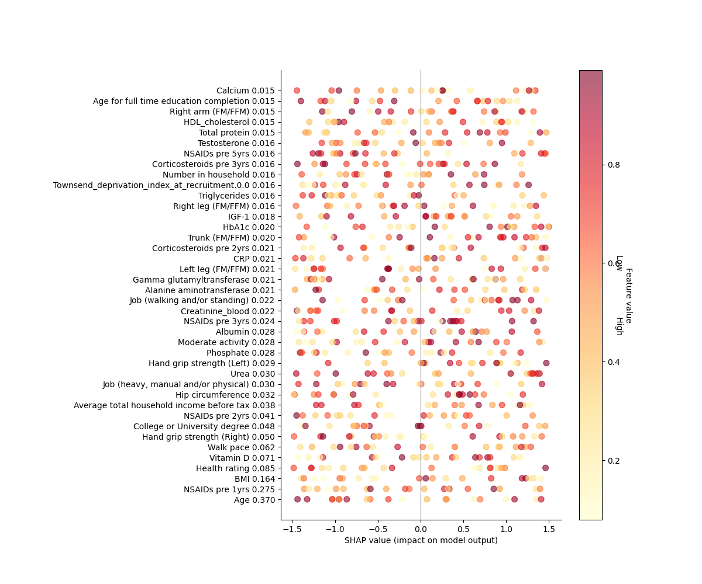

# 图像生成和分析自动化工具

## 项目简介
通过 Claude API 实现科学图的自动化分析与代码生成。程序接收用户图片，调用 Claude AI 根据图片生成 Python 绘图代码，执行生成的代码，生成并保存图像。

## 功能模块
1. **图像编码**：将用户上传的图像转换为 Base64 格式，用于 API 请求。
2. **Claude API 调用**：根据用户提供的图像及提示词生成 Python 绘图代码。
3. **代码执行与结果保存**：自动执行生成的代码，生成图表并保存为 PNG 文件。
4. **错误处理与重试机制**：在代码执行失败时，重新提示 Claude API 修正错误并重试生成图像，more最大重试3次。
5. **代码与文档输出**：将生成的代码与注释保存为 JSON 文件。

## 依赖环境

- `base64`
- `anthropic`
- `matplotlib`
- `tempfile`
- `os`
- `datetime`
- `json`

## 示例结果

### 输入：
- 图片路径：`/path/to/image.png`

### 输出：
- 生成的图像文件：`20241222_image.png`
- 生成的 JSON 文件：`20241222_image.json`
